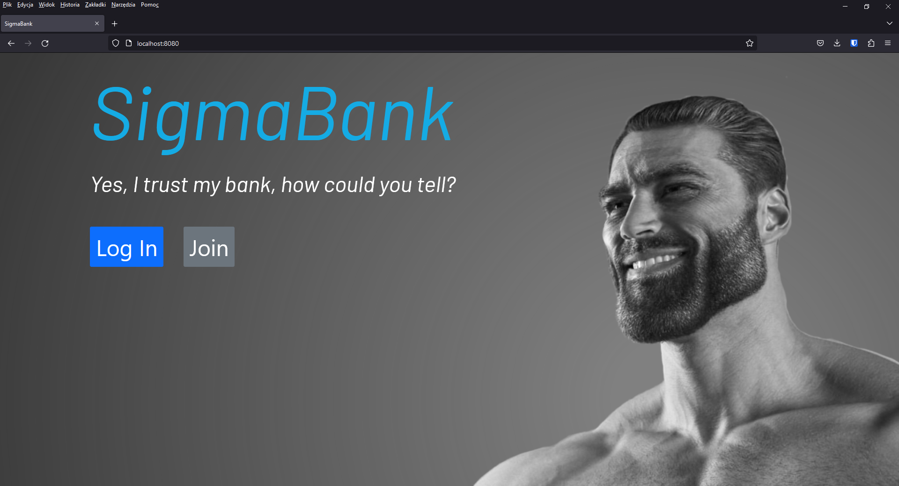

# Overview
This web application is a simple bank website built using the Spring Framework and follows the Model-View-Controller (MVC) architecture. 
The application allows users to register, log in, view their account balance, perform transactions like transfers between different cards and different currencies. 
Users can also view their transaction history, print transactions to pdf files, manage their profile information, manage their cards and contacts.
 

# Technology Stack
 - Spring Framework: a popular Java-based framework for building web applications.
 - PostgreSQL: an open-source relational database management system.
 - JavaMail API: a Java-based API for sending emails.

# The application includes the following functionality:
 - User registration: allows users to create an account and log in to the application. An email confirmation message is sent to the user upon successful registration.
 - First-time login form: if it's the user's first time logging in, they are required to fill in a form with their personal information.
 - Account balance: displays the user's account balance.
 - Transfers: allows users to transfer cash to other users from different cards. Users can transfer their cash between different currencies, and the system will automatically change the currency to the correct one.
 - Transaction history: allows users to view their transaction history and print transactions to pdf files.
 - Profile: allows users to change their personal information.
 - Cards: displays all the user's cards. Users can add new cards (set the card currency and set an image for it).
 - Contacts: allows users to save other users' information (which can be used in transfers to speed up the process).

# Detailed information
## User perspective
### User registration
1. Registration Form  
   The registration form allows users to enter their personal information, including their name, email address, and password. Once the user has completed the form, they can click the 'Join' button to submit their information.
   
2. Email Confirmation  
   After the user submits their information, the application uses the JavaMail API to send a confirmation email to the email address provided by the user. The email contains a unique link that the user can click to confirm their email address.
   To simulate the process of receiving and confirming the email, the application uses 'maildev', a tool that allows for email testing without actually sending emails to real email addresses. 'maildev' runs on a local server, and emails sent by the application are intercepted by 'maildev' and stored for viewing.

3. Email confirmed  
   Now you should be able log in.
   

### Logging In and Completing Personal Information

1. Click on the "Log In" button on the homepage.
2. Enter your username and password in the provided fields.
3. Click on the "Submit" button to log in.

If it is your first time logging in, you will be prompted to fill out a form with your personal information, such as your name, surname, and address.

Once you have completed the form, you will be logged in to the service.

### Editing Your Personal Information
Click on the "Profile" button in the main navigation menu.

### Managing Your Credit Cards
To manage your credit cards, follow these steps:
1. Log in to your account.
2. Click on the "Cards" button in the main navigation menu.
3. Here you can see a list of all the credit cards you have added to your account.
4. To add new credit card set the card's currency. If you wish to upload your own image for the card, click on the upload image button and select the image file from your computer. If you don't want to use your own image, a default image will be used.

### Managing Your Contacts
1. Log in to your account.
2. Click on the "Contacts" button in the main navigation menu.
3. Here you can see a list of all the contacts you have added to your account. To edit a contact, click on the "Edit" button next to the contact you want to edit.
4. In the editing form, you can change the contact's details as needed.
5. To delete a contact, click on the "Delete" button next to the contact you want to remove.

You can use your saved contacts to speed up the process of transferring cash to other users. When you are on the transfer page, you can select a contact from your list instead of manually entering their details.

### Transferring Cash
1. Log in to your account.
2. Click on the "Transfer" button in the home page.
3. Here you can see a form for transferring cash. First, choose the credit card you want to transfer money from.
4. Next, select the receiver of the transfer. You can either select a receiver from your contacts list or manually type in their credit card number.
5. Enter the amount of cash you want to transfer in the appropriate field.
6. You can also add a message to the receiver in the message field.
7. After verifying that all the information is correct, click on the "Transfer" button to initiate the transfer.

Please note that transfers between different currencies will be automatically converted by the system. Also, you can only transfer cash from your own credit cards to another user's credit card within the service.

### Transfer History
1. Log in to your account.
2. Click on the "History" button in the main navigation menu.
3. Here you can see a list of all your transfers to other users, including the date, the credit cards involved, the amount of cash transferred, and the status of the transfer (waiting, accepted, or rejected).
4. You can use the search bar to filter your transfer history by your own or the receiver's credit card number, or by the transfer status.
5. To print a transfer, click on the "Print" button next to the transfer. A PDF file will be generated that you can save or print.

## Admin panel
### Home page
The admin panel allows the administrator to view all transfers that are made in the bank. The home page of the admin panel displays a list of all transfers, along with their details, such as the sender's credit card number, the receiver's credit card number, the transfer amount and date.
The admin can change the status of a transfer by clicking on the 'Accept' button next to the transfer.

### Transfer
As an admin, you have the ability to transfer cash to any credit card in the system. Here's how you can do it:
1. Log in to the admin panel of the bank website. 
2. Navigate to the "Transfer" section. 
3. Select the credit card from which you want to transfer cash. 
4. Enter the amount of cash you want to transfer. 
5. Click "Transfer" to complete the transfer. 
6. The transfer will be processed and the recipient's balance will be updated accordingly.

